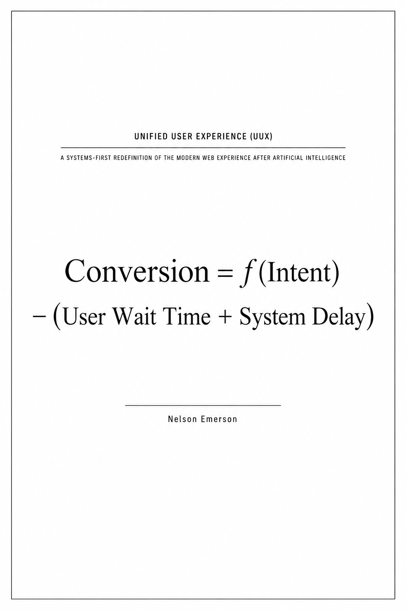

# UUX Design — The Paradigm Shift

**Unified User Experience (UUX)** is a systems-first redefinition of the modern web experience after artificial intelligence — a proposed framework built on three foundational stances: **Operations-First**, **Mobile-Second**, and **Design-Centered**.

> Conversion = f(Intent) − (User Wait Time + System Delay)

This repository holds the published treatise and its cover.

**Landing page:** [odesealabs.com/uux](https://odesealabs.com/uux)

**Read the treatise:** [UUX-Treatise.md](./UUX-Treatise.md)

  

## What's in the treatise

Eighteen chapters across five parts:

- **Part I — The Premise:** why the interface-centric website broke, and what replaces it.
- **Part II — The Framework:** the three foundational principles — Operations-First, Mobile-Second, Design-Centered.
- **Part III — The Discipline:** why design matters more (not less) in an AI-commoditized production landscape, and how the economics of web design are shifting.
- **Part IV — The Model:** a working definition of UUX and a seven-step Operations-First, Mobile-Second framework, plus an explicit boundary of what this framework is not.
- **Part V — Toward a Next Generation:** the future interface, a challenge to the industry, and the conclusion.

## Author

Nelson Emerson, 2026
