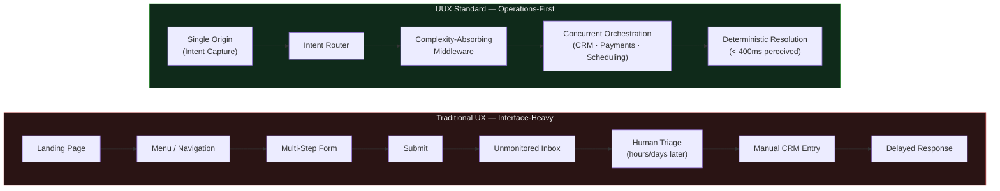

# UUX Design — The Paradigm Shift

> **Operations-First. Mobile-Second. Design-Centered.**
> An open-source, systems-first specification — and reference framework — for building websites as operational surfaces instead of static interfaces.

<p align="center">
  <a href="https://github.com/NelsonEm9/uux-design-the-paradigm-shift/subscription"><strong>🔔 Get notified when the full UUX book is released →</strong></a>
  &nbsp;|&nbsp;
  <a href="https://odesealabs.com/uux"><strong>🛰️ Follow UUX Standard development updates →</strong></a>
</p>

---

## The UUX Equation

```
Conversion = f(Intent) − (User Wait Time + System Delay)
```

Every millisecond a system makes a human wait — on the screen or behind it — is friction subtracted directly from conversion. Traditional UX treats this as a rendering problem. UUX treats it as an architecture problem: intent decays exponentially the longer it takes to resolve, so the system's job is to resolve it before it decays.



Traditional UX optimizes the six boxes on top — button color, form field order, page transitions — and calls the job done at "Submit." UUX starts at "Submit" and asks what happens next: is intent routed, decided, and acted on before it decays, or does it die in a queue?

---

## Why This Exists

For three decades, a website was a digital brochure: a static surface judged by how it looked for the five seconds before someone clicked away. AI didn't kill that discipline — it destroyed the *scarcity* of producing it. Layout, code, copy, and imagery are now commodity outputs of a prompt.

What AI cannot commoditize is what happens **after** the click. Most websites still stop working the moment a visitor hits "Submit": the payload flattens into an email, lands in an unmonitored inbox, and waits for a human to copy-paste it into a CRM. The interface promised real-time software. The architecture delivered a mailbox.

UUX is the standard for closing that gap — treating the website as the **operational surface** of the business: the ignition switch that captures intent and instantly fires the deterministic engine behind it, rather than the destination where the journey ends.

Three foundational stances define it:

- **Operations-First** — Business logic, routing, and automation are designed before a single pixel is placed. Cognitive load is a backend architecture failure, not a layout problem.
- **Mobile-Second** — The system is designed first; mobile is the contextual expression of an already-complete operational engine, not the architectural starting point.
- **Design-Centered** — Design is the binding agent between human intent and business logic — the interpreter, the regulator of cognitive load, and the architecture of trust. It is not decoration.

---

## The UUX Implementation Checklist

A concrete evaluation tool for engineers and product teams — not a philosophy quiz. Score your product against each stage of the Operations-First, Mobile-Second framework.

### 01 — Understand the Operation
- [ ] Every backend system a customer interaction touches (CRM, scheduling, payments, messaging) is mapped and documented.
- [ ] Manual bottlenecks — where staff currently re-key, re-route, or re-triage data by hand — are identified and named.
- [ ] Leakage points, where intent is lost to slow response or disconnected systems, are quantified.

### 02 — Define the Desired Outcomes
- [ ] Success is measured by **time-to-resolution**, not just form submissions or page views.
- [ ] Every interface trigger has an explicit, deterministic backend end state (invoice issued, booking confirmed, lead routed) — not a vague "we'll be in touch."
- [ ] Operational KPIs exist for data integrity and automated response latency.

### 03 — Design the Invisible System
- [ ] Static forms are replaced with dynamic, context-aware intake that validates and routes in real time.
- [ ] Complexity is absorbed by infrastructure (state persistence, payload transformation, headless API resolution) — never dumped on the user as extra fields.
- [ ] Automated vs. human-required touchpoints are explicitly delineated.
- [ ] Async retries and session persistence exist so no state is lost across a webhook or network failure.

### 04 — Design the Experience
- [ ] Choice fatigue is eliminated by dynamic, pre-filtered routing rather than multi-page menus (**Hick's Law**, reframed as a system-intelligence failure, not a UI pattern).
- [ ] Manual data entry is minimized via context and pre-validated input state (**Miller's Law**, reframed as backend normalization instead of visual chunking).
- [ ] The system feels human and transparent, not cold or sterile, even where it is fully automated.

### 05 — Build the Interface
- [ ] Optimistic UI and edge caching keep perceived response time under the **Doherty Threshold (400ms)**.
- [ ] The fastest button is the one the user never has to press (**Fitts's Law**, reframed as automated state execution).
- [ ] Visual ornament that doesn't clarify the system underneath is removed.

### 06 — Translate Across Contexts
- [ ] System architecture is built first; mobile, tablet, and desktop are adapted presentations of one engine — not three separately-scoped builds.
- [ ] Interaction is ergonomically tailored per surface (single-tap, thumb-reach triggers on mobile vs. dense multi-pane operational views on desktop).
- [ ] A workflow started on one device/channel can resume on another without losing state.

### 07 — Measure and Evolve
- [ ] Telemetry instruments the operational pipeline itself (routing failures, payload validation errors, response latency) — not just page analytics.
- [ ] Drop-off points inside the routing engine, not just the funnel, are analyzed and fed back into rule changes.
- [ ] The system is treated as living infrastructure with continuous stewardship — never a "launched and forgotten" deliverable.

---

## `@uux-design/core` — Reference Implementation (Step 1)

A strict, type-safe TypeScript package implementing the UUX equation as running code: a latency profiler, an intent router, and a complexity-absorbing middleware, wired together by a single framework entry point.

```
uux-design-the-paradigm-shift/
├── src/
│   ├── time.ts          # shared timing + Doherty Threshold + Intent Decay constants
│   ├── profiler.ts      # UUXProfiler — measures the UUX equation per intent
│   ├── router.ts        # IntentRouter — deterministic categorization + webhook fan-out
│   ├── middleware.ts    # ComplexityAbsorberMiddleware — normalization, optimistic ack, silent retries
│   └── index.ts         # UUXFramework — wires profiler + router + middleware together
└── example/
    └── basic-implementation.ts
```

### Install & run the example

```bash
npm install
npm run example
```

### Quick usage

```ts
import { UUXFramework, createMockWebhook } from '@uux-design/core';

const framework = new UUXFramework({ mobileSecond: true });

framework.router.registerRule({
  id: 'urgent-support',
  category: 'support',
  priority: 0,
  test: (payload) => payload.parameters.urgent === true,
});

framework.router.registerWebhook(createMockWebhook('crm-sync', 40));

const resolved = await framework.resolveIntent(
  {
    intentId: 'intent_1',
    rawText: 'Need an emergency repair quote ASAP',
    parameters: { urgent: true },
    source: 'web',
    submittedAt: Date.now(),
  },
  /* intentWeight */ 5,
);

console.log(resolved.score.normalizedScore, resolved.routing.decision.category);
```

Full runnable walkthrough: [`example/basic-implementation.ts`](./example/basic-implementation.ts).

---

## Read the Treatise

This package is the code-first companion to the published treatise: [`UUX-Treatise.md`](./UUX-Treatise.md).

Eighteen chapters across five parts:

- **Part I — The Premise:** why the interface-centric website broke, and what replaces it.
- **Part II — The Framework:** the three foundational principles — Operations-First, Mobile-Second, Design-Centered.
- **Part III — The Discipline:** why design matters more (not less) in an AI-commoditized production landscape, and how the economics of web design are shifting.
- **Part IV — The Model:** a working definition of UUX and a seven-step Operations-First, Mobile-Second framework, plus an explicit boundary of what this framework is not.
- **Part V — Toward a Next Generation:** the future interface, a challenge to the industry, and the conclusion.

<p align="center">
  
</p>

## Contributing

This is now an open specification. Issues and pull requests against the treatise, the checklist, or `@uux-design/core` are welcome — this repo is the canonical, evolving version of UUX; the book is the fixed-point-in-time artifact it grew out of.

## Author

Nelson Emerson, 2026
